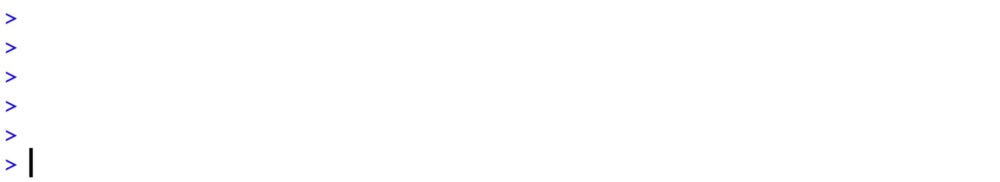

<!-- README.md is generated from README.Rmd. Please edit that file -->

# :eyes: assert

<!-- badges: start -->

[](https://cran.r-project.org/package=assert)
[](https://travis-ci.org/OlivierBinette/assert)

<!-- badges: end -->

Lightweight validation tool for checking function arguments and data
analysis scripts. This is an alternative to stopifnot() from the ‘base’
package and to assert\_that() from the ‘assertthat’ package. It provides
more informative error messages and facilitates debugging.



## Installation

You can install the released version of assert from
[CRAN](https://CRAN.R-project.org) with:

``` r
install.packages("assert")
```

And the development version from [GitHub](https://github.com/) with:

``` r
# install.packages("devtools")
devtools::install_github("OlivierBinette/assert")
```

## Examples

Assertions throughout a data analysis workflow:

``` r
library(assert)
attach(ChickWeight)

# Passing assertions
assert(is.numeric(weight),
       all(weight > 0))
```

``` r
# Failing assertions
assert(all(Diet > 0),
       is.numeric(Times))
#> Error in assert(all(Diet > 0), is.numeric(Times)) : 
#> Failed checks: 
#>      all(Diet > 0)   (NA)
#>      is.numeric(Times)   (object 'Times' not found)
```

Validate function arguments:

``` r
# Sample from a multivariate normal distribution
rmultinorm <- function(k, mu, sigma) {
  assert(is.numeric(k),
         length(k) == 1,
         k > 0,
         msg = "Number of samples `k` should be a positive integer")
  assert(is.numeric(mu),
         is.matrix(sigma),
         all(length(mu) == dim(sigma)),
         msg = "Mean vector should match the covariance matrix dimensions.")

  p <- length(mu)
  t(chol(sigma)) %*% matrix(rnorm(p*k, 0, 1), nrow=p) + mu
}

mu <- c(0,10)
sigma <- matrix(c(2,1,1,2), nrow=2)
rmultinorm(3, mu, sigma)
#>            [,1]      [,2]      [,3]
#> [1,]  0.1636879  3.779179 -1.631468
#> [2,] 10.7216599 13.251040 10.102402
```

``` r
rmultinorm(mu, 3, sigma)
#> Error: in rmultinorm(k = mu, mu = 3, sigma = sigma)
#> Failed checks: 
#>      length(k) == 1
#>      k > 0   (c(FALSE, TRUE))
#>
#> Number of samples `k` should be a positive integer 
```

## Philosophy

Function argument checks should throw errors as early as possible and at
the *function* level. When `assert` is used within a function, all
assertions are executed within `tryCatch` statements, error messages are
recovered, and a single error is thrown from `assert`. This ensures that
“object not found” errors and assertion execution errors are also caught
as part of argument checks. The function signature and call are also
included as part of error messages to facilitate debugging.

## Performance

Because `assert` executes each assertion inside of a tryCatch()
statement and recovers error messages, it is not quite as efficient as
`stopifnot` (which sequentially executes assertions without catching
potential errors). `assertthat::assert_that` has the most overhead.

``` r
library(assertthat)

bench::mark(assert(TRUE),
            assert_that(TRUE),
            stopifnot(TRUE),
            check=FALSE)
#> # A tibble: 3 x 6
#>   expression             min   median `itr/sec` mem_alloc `gc/sec`
#>   <bch:expr>        <bch:tm> <bch:tm>     <dbl> <bch:byt>    <dbl>
#> 1 assert(TRUE)        69.1µs  76.35µs     4505.        0B     15.6
#> 2 assert_that(TRUE)   18.5µs  20.92µs    27812.    26.9KB     39.0
#> 3 stopifnot(TRUE)      1.8µs   2.48µs   220063.        0B     44.0
```
